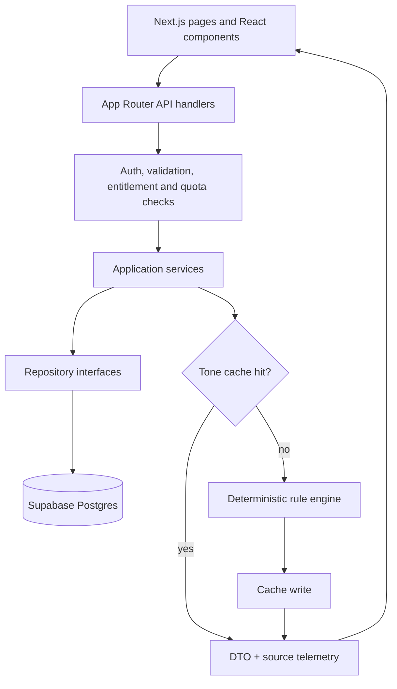
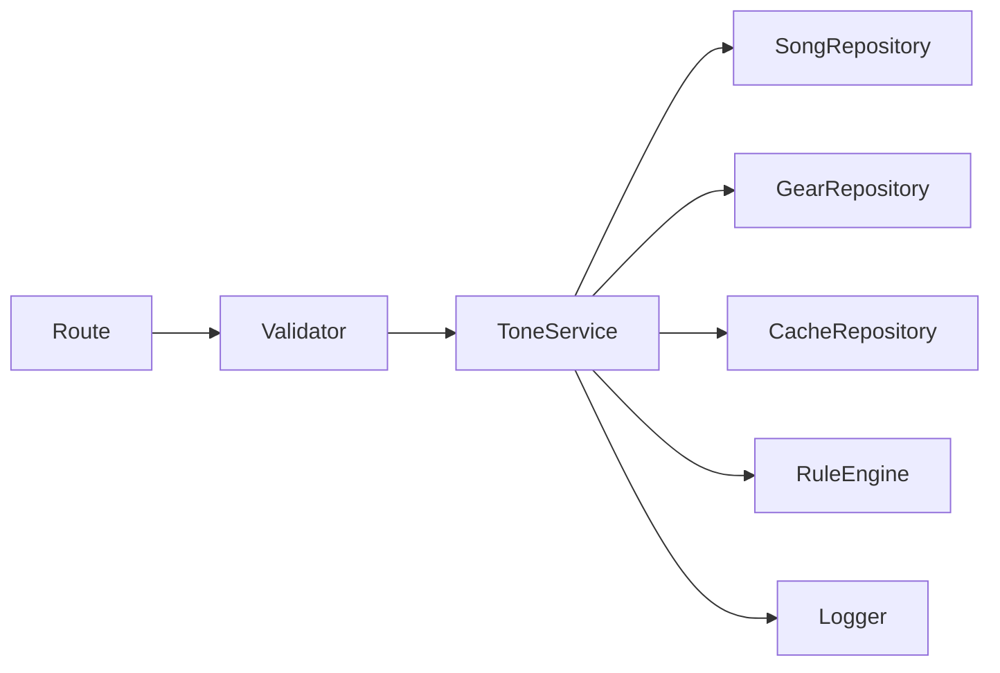

# Architecture

## System flow

The requested conceptual order is implemented as two cooperating paths: repositories load Supabase data before the rule engine, and the cache is checked before engine execution. A cache miss runs the engine and must persist the result before a successful response.

## Frontend

`app/` uses Next.js App Router. Public marketing/catalog pages use `SiteShell`; authenticated product pages use `AppShell`. Client components own interactive form state and call route handlers with `fetch`. Supabase browser auth is used by auth/account/profile UI. There is no Redux-style global store; state is component-local, URL-driven, server-loaded, or persisted in Supabase.

## API boundary

Route handlers in `app/api` perform HTTP parsing, authentication, access checks, and response shaping. `/api/v1/tones/adapt` is the current structured backend. `app/api/[...path]/route.ts` is a broad compatibility layer for older UI contracts and external music search.

## Service and repository layers

`lib/backend/tone-adaptation` is split into DTO validation, controller/service orchestration, focused gear/song/amp/pickup/pedal/cabinet/MultiFX services, and Supabase repositories. `lib/backend/ai-ingestion` follows the same pattern for job queues and master-tone storage.

## Supabase

Three clients have distinct trust levels:

- Browser client: anon key + RLS.
- Server SSR client: anon key + user cookies + RLS.
- Admin client: service role, server-only, used for privileged writes, quotas, ingestion, and cache-backed adaptation.

Configuration checks ensure URL/key project references agree when JWT project refs are available.

## Tone engine and cache

The pure rule pipeline executes fixed stages from master tone through tone type, guitar, pickups, amp, cabinet, pedals, direct mode, and MultiFX mapping. Values are clamped to 0-10 and output includes notes, warnings, effects, audit entries, and conflict records.

`tone_adaptation_cache` is keyed by a stable signature containing schema/version and all tone-affecting selections. A valid hit is touched and returned; a miss runs rules and writes a cache row. A failed cache write is treated as a backend failure, not an uncached success.

## AI boundary

OpenAI is used by the admin ingestion pipeline to research/normalize missing source knowledge and optionally produce embeddings. The rule engine has no OpenAI import. Backend tests also cover an optional source-hydration path when a master tone is absent; this is distinct from per-request AI tone generation and must remain explicit in source telemetry.

## Compatibility layers

- `song_tone_profiles` bridges older song profiles while `master_tones` is the normalized target.
- `gear_items` and normalized model tables remain from earlier catalog phases.
- `equipment` is canonical for guitar/amp user search.
- `guitar_brands`/`amp_brands`/`pedal_brands`/`multifx_brands` support searchable selectors and compatibility columns.
- The catch-all API retains old paths; several unsupported catalog branches currently return empty arrays.
