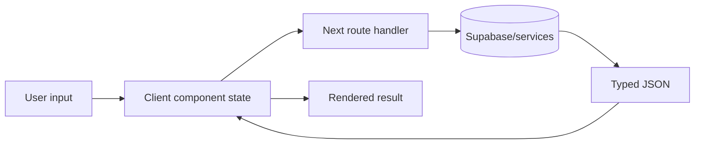

# Frontend

## Page structure

| Route | Main implementation |
|---|---|
| `/` | Marketing home using `SiteShell`, reviews, and quick gear search. |
| `/app` | Authenticated tone matcher in `AppShell`. |
| `/gear` | My Gear profile; paid users get `AppShell`, public visitors can see the site shell path. |
| `/library`, `/library/[toneId]` | Saved tone list/detail. |
| `/community`, `/community/[profileId]` | Community browse/detail and adapt CTA. |
| `/songs`, `/songs/[songSlug]`, `/artists`, `/artists/[artistSlug]` | SEO catalog pages. |
| `/welcome` | Authenticated onboarding state. |
| `/plans`, `/account`, `/checkout/success` | Billing/account flows. |
| `/login`, `/signup`, `/forgot-password`, `/reset-password`, `/auth/complete` | Supabase Auth flows. |
| `/contact`, `/feedback`, `/status`, `/privacy`, `/terms` | Support and informational pages. |

`app/layout.tsx` defines metadata, fonts/global CSS, analytics, and the root event tracker. Dynamic song/artist/community pages provide metadata from local/database helpers.

## Component ownership

- `SiteShell`: public navigation/footer shell.
- `AppShell`: authenticated sidebar/navigation and account context.
- `ToneMatcher`: large client workflow for song research, gear selection, adaptation, save, and result presentation.
- `GearView`: My Gear profile and preset creation surface.
- `MyGearSelectors`: autosaved guitar/amp/pedal/MultiFX selectors backed by `profiles.my_gear_profile`.
- `SearchableGearDropdown`: reusable debounced remote search UI consuming `{results}` endpoints.
- `LibraryView` / `SavedToneDetail`: saved tone history.
- `CommunityView` / `CommunityToneCta`: browse and reuse community tone profiles.
- `AuthForm`, `AccountView`, `Pricing`, `CheckoutSuccessTracker`: identity and billing.
- `AppEventTracker`: client event collection through `/api/v1/events`.

## State and data flow

There is no global state library. Server components load session/catalog data and pass props. Client components use React state/effects, URL parameters, `fetch`, and Supabase browser calls. Persistent user state lives in Supabase; transient search/result state lives in components.

## Gear page flow

`MyGearSelectors` configures four independent `SearchableGearDropdown` endpoints: guitars, amps, pedals, and MultiFX. Selections are normalized to `GearSearchItem` and autosaved into `profiles.my_gear_profile`; guitar/amp use `equipment`, pedal uses `pedal_models`, and MultiFX uses `multifx_models`.

## Styling

Global styles and Tailwind utilities define the current visual system. Existing components use a dark navy/white/lime Tonefex identity, Framer Motion for selected animations, and Lucide icons. Preserve this established language rather than introducing a separate design system.

## Frontend change rules

- Keep server-only keys and admin clients out of client components.
- Preserve loading, empty, unauthenticated, quota, and error states.
- Keep desktop/mobile behavior functional.
- Reuse established shells and dropdown/result patterns.
- When endpoint payloads change, update component types and `API.md` together.
