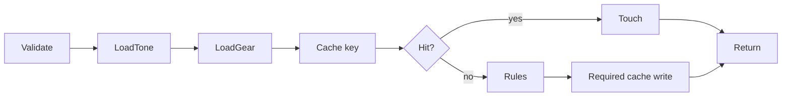

# Tone Engine

The engine combines gear-independent `master_tones`, the orchestration in `lib/backend/tone-adaptation`, and the pure transformation in `lib/rule-engine`. `lib/tone-core.ts` is an older compatibility resolver.

## Fixed order

```text
load_master_tone
tone_type
guitar_profile
pickup_profiles
amplifier_profile
cabinet_profile
pedals
going_direct
multifx_mapping
final_tone
```

Rules sort by stage, priority, then ID. They add bounded deltas to a copied master setting map, round to halves, clamp to 0-10, and record audit/conflict information. Output includes settings, EQ/modulation, effects, MultiFX parameters, notes, warnings, audit, conflicts, and AI metadata.



The rule engine never imports OpenAI. Admin ingestion is the preferred missing-source path; any source hydration must stay explicit through `aiUsed`, `openAiCalled`, and `sourceHydrationUsed`. Add stable rule IDs/tests and bump cache versions when semantics change.
